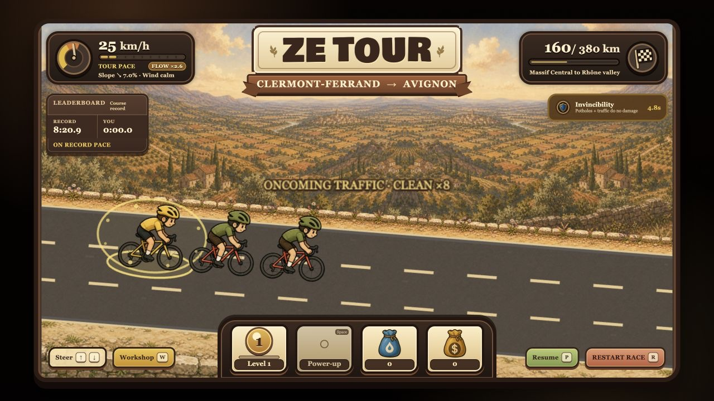
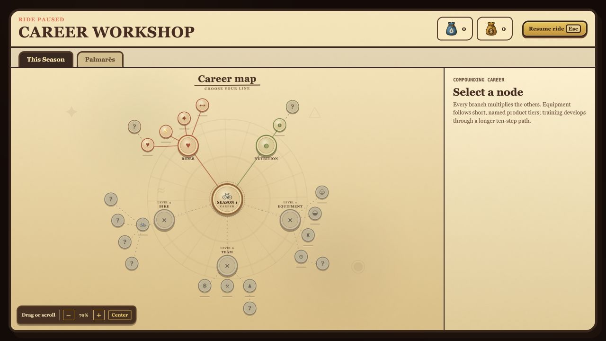

# Ze Tour

> An incremental cycling game about riding across France, dodging chaos, building an impossible bike, and turning respectable Tour pace into completely unhinged numbers.

[](LICENSE)
[](https://vuejs.org/)
[](https://phaser.io/)
[](https://www.typescriptlang.org/)

Ze Tour combines a three-lane arcade ride with an incremental economy. Draft riders, collect resources, avoid potholes and oncoming traffic, raise your Rider Level, buy real-world cycling upgrades, and watch the numbers explode.



## Entirely vibe-coded with Codex

**This game was entirely vibe-coded using [Codex](https://openai.com/codex/).** Creative direction, taste, play-testing, and a healthy amount of blunt feedback stayed human; Codex helped turn that conversation into the game design, code, generated visual assets, balancing, tests, and documentation.

It is an experiment in building a complete, playable game through tight human–AI iteration: describe the feeling, play the result, point at what is boring or ugly, and keep going until it is fun.

## Screenshots

### Career Workshop

The workshop presents Rider, Nutrition, Equipment, Bike, and Team progression as a draggable, zoomable career map.



## What is in the game

- A readable three-lane road with automatic forward motion and optional steering.
- Five sectors from Paris to Alpe d'Huez, each with its own landscape and challenge.
- Potholes, hairpins, gravel, crosswinds, traffic encounters, fans, pickups, and drafting lines.
- Acceleration, Super Draft, and Invincibility power-ups with genuinely different uses.
- A Career Workshop spanning Rider, Nutrition, Equipment, Bike, and Team upgrades.
- Short, named equipment paths based on plausible cycling gear—not 100 anonymous helmet levels.
- A continuous Rider Level fed by riding, clean challenges, pickups, and power-up use.
- A believable 25–80 km/h permanent pace curve alongside exponential production, offline progress, and increasingly absurd costs.
- A Season prestige loop with permanent Palmarès upgrades and persistent course records.
- A hand-drawn storybook presentation with a slightly ridiculous cycling soul.

## The loop

1. Ride automatically, earn Rider XP, and generate **Sweat** and **Cash**.
2. Steer into bags, drafting lines, and power-ups while avoiding road hazards.
3. Spend resources in the Career Workshop to compound pace and production.
4. Raise Rider Level to unlock Equipment at 2, Bike at 3, and Team at 6.
5. Reach Alpe d'Huez and take a victory lap, or bank the run as **Palmarès**.
6. Start a stronger Season, buy permanent bonuses, and chase the next impossible number.

Sweat and Cash belong to the current Season. Palmarès is earned by finishing Tours and survives the reset.

## Controls

| Action | Keyboard | On-screen control |
| --- | --- | --- |
| Change lane | `↑` / `↓` | Steer |
| Use power-up | `Space` | Power-up |
| Open or close workshop | `W` | Workshop |
| Pause or resume | `P` or `Esc` | Pause |
| Restart race | `R` | Restart |

Forward travel is automatic. Steering improves active rewards, but passive and offline progress remain viable.

## Run locally

### Requirements

- Node.js `20.19+` or `22.12+`
- npm

### Setup

```sh
git clone git@github.com:nbonamy/zetour.git
cd zetour
npm ci
npm run dev
```

Open the local URL printed by Vite.

## Development

```sh
npm test          # run the Vitest suite once
npm run test:watch
npm run typecheck
npm run build
npm run calibrate:economy
npm run simulate:economy -- --minutes=120 --runs=3 --seed=42 --strategies=casual,skilled --check
```

The app uses Vue for the interface and workshop, Phaser for the road simulation, and a framework-independent TypeScript core for the economy and progression rules.

The economy simulator runs the real game store and encounter rules with deterministic seeds. It checks first-purchase timing, Tour duration, Rider Level stage checkpoints, the ordinary-tree runway, the permanent 25–80 km/h invariant, and the $100M Hyperbike capstone arrival. Use `--strategies=casual,skilled` for focused runs, `--progression=none` to isolate Rider Level, `--trace=skilled` for a purchase trace, `--check` for a failing calibration gate, or `--json` for machine-readable results.

```text
src/
├── components/       Vue game and workshop UI
├── core/             economy, upgrades, saves, progression, and records
├── game/             Phaser scene, rendering, encounters, and ride systems
├── App.vue            application shell and HUD
└── styles.css         visual system and responsive layout
public/assets/         runtime art and fonts
art-source/            source artwork used by the asset pipeline
scripts/               economy simulation and asset-processing tools
tests/                 unit and component tests
```

The save is stored locally in the browser. Development builds also support save-neutral visual-QA query parameters such as `qaFresh=1`, `qaPaused`, `qaStage`, `qaEncounter`, `qaFlow`, and `qaPowerUp` for repeatable screenshots. `qaFresh=1` runs an isolated Level 1 career without reading or changing the normal save.

## Tour structure

| Sector | Route | Main challenge |
| --- | --- | --- |
| 1 | Paris → Bordeaux | Flat road |
| 2 | Bordeaux → Clermont-Ferrand | Périgord gravel climb |
| 3 | Clermont-Ferrand → Avignon | Fast descent |
| 4 | Avignon → Grenoble | Mistral crosswind |
| 5 | Grenoble → Alpe d'Huez | 21-bend summit finish |

The displayed route covers 1,615 km. Simulation distances are compressed so a Tour is playable. Permanent neutral-flat pace follows the authored 25–80 km/h curve; terrain, wind, drafting, and temporary power-ups are applied afterward.

## Contributing

Issues and focused pull requests are welcome. Please run `npm test`, `npm run typecheck`, and `npm run build` before submitting a change, and keep gameplay changes covered by deterministic core tests where possible.

The living design notes are in [game-design.md](game-design.md), with the incremental progression proposal in [plans/incremental-seasons.md](plans/incremental-seasons.md).

## License

Licensed under the [Apache License 2.0](LICENSE).
