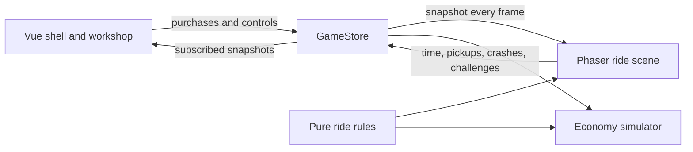

# Phaser runs the road, not the game

Ze Tour uses Phaser 4, but only for the part that benefits from being a game engine: the moving strip of France where riders, bags, potholes, cars, fans, and particles fly past one another.

The title, HUD, leaderboard, controls, dialogs, Career Workshop, and Palmarès screens are ordinary Vue. More importantly, Phaser does not own the career. The authoritative economy and progression state lives in a plain TypeScript `GameStore` that can run without a canvas—or even a browser.



That split is the reason the economy simulator can drive the real game rather than maintain a second, inevitably-wrong spreadsheet model.

## One scene, one moving theatre

[`GameCanvas.vue`](../src/components/GameCanvas.vue) creates exactly one Phaser game when Vue mounts the road and destroys it when the component leaves. Vue also translates the app-level pause state into a pause or resume of the Phaser scene.

[`createGame.ts`](../src/game/createGame.ts) configures:

- one scene named `ride`;
- Arcade Physics with no gravity;
- a fixed, fitted canvas with antialiasing;
- a logical 640 × 360 road composed at 2× render scale.

The fixed world matters. Gameplay geometry never changes when the browser does; Phaser fits and centers the same road inside the available DOM space. That avoids making “bottom lane” mean something different on every monitor.

## The bicycle mostly stays still

The world is a treadmill. The player remains near the left side of the scene while everything else moves left according to the rider's effective pace:

```text
km/h → metres/second → road pixels/second → scenery and object movement
```

The conversion lives in [`rideSystems.ts`](../src/game/rideSystems.ts). The 640-pixel viewport represents roughly 44 metres of road, which keeps 25 km/h visually readable while still making an upgraded 80 km/h rider feel dramatically faster.

Each Phaser update does four important things:

1. Advance the real `GameStore` using elapsed seconds.
2. Read a fresh immutable snapshot of pace, slope, stage, upgrades, and active powers.
3. Move the tiled landscape, verges, lane markers, fans, pickups, hazards, and draft riders.
4. Turn overlaps and completed challenges back into store actions such as `collectBag`, `hitTraffic`, or `completeChallenge`.

The road itself is assembled from several independently scrolling layers. Stage landscapes, upper and lower verges, asphalt or gravel textures, lane markers, sprites, and procedural streaks remain separate objects. This is why the landscape can change by sector while fans and roadside details still scroll at the same physical speed.

## Physics, but only where it helps

Arcade Physics is used for overlap detection, not for bicycle dynamics. Pickups and hazards live in physics groups, and the rider overlaps those groups to trigger collection or damage. Their motion is explicitly controlled by the road model, so collision bodies are synchronized to their visual positions after movement.

Lane changes are deliberately eased rather than teleported. Slope is also visualized without rotating the entire canvas: road objects receive an x-dependent vertical offset, and riders are angled to match the same gradient. That keeps all three collision lanes coherent on climbs and descents.

## Rules outside the scene

The large [`GameScene.ts`](../src/game/GameScene.ts) is the director, but much of its logic is extracted into pure functions:

- [`rideSystems.ts`](../src/game/rideSystems.ts) owns encounter selection, traffic routes, safe lanes, drafting tolerances, reward difficulty, Flow, and physical scroll speed.
- [`rendering.ts`](../src/game/rendering.ts) owns lane centers, sprite grounding, body synchronization, and time-based visual effects.
- [`visualQa.ts`](../src/game/visualQa.ts) can force a precise stage, gradient, encounter, speed, draft, or power-up in development builds.

Those functions are usable in Vitest and, where relevant, by the headless economy simulator. Phaser remains the kinetic presentation layer; it is not allowed to become a second source of truth.

## What Phaser deliberately does not own

- Sweat, Cash, XP, Rider Level, purchases, dependencies, and Palmarès
- permanent and temporary stat calculations
- save migration and local persistence
- the Vue HUD and Workshop
- music playback, which uses the Web Audio API directly

It is a slightly unusual Phaser architecture, but it fits Ze Tour: the arcade road can be loud and animated while the incremental game underneath stays deterministic, inspectable, and simulatable.
